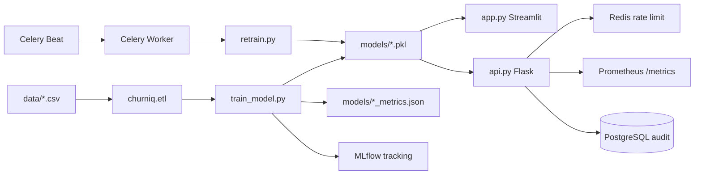

# ChurnIQ — Bronze / Silver / Gold

ChurnIQ là hệ thống dự đoán customer churn theo 3 tầng trưởng thành:

- **Bronze**: local MVP, chạy bằng CSV → ETL → Random Forest → Streamlit/API.
- **Silver**: Docker Compose, MLflow, Redis rate limit, drift monitoring, retrain CLI.
- **Gold**: Celery scheduled retrain, A/B shadow routing, PostgreSQL audit tables, CI/CD và Prometheus metrics.

## Quick Start Bronze

```bash
pip install -r requirements.txt
python train_model.py
streamlit run app.py
```

API local:

```bash
python api.py
pytest tests/ -v
```

## Silver / Gold Stack

```bash
docker compose up -d
```

Services:

- Streamlit app: http://localhost:8501
- Flask API: http://localhost:8001
- API docs: http://localhost:8001/docs
- Metrics: http://localhost:8001/metrics
- MLflow UI: http://localhost:5000
- Redis: localhost:6379
- PostgreSQL: localhost:5432

Run migrations:

```bash
alembic upgrade head
```

Manual retrain:

```bash
python retrain.py --dataset telco_ibm --reason "drift"
python retrain.py --dataset call_details --reason "scheduled"
```

## Architecture



## Project Structure

```text
app.py                  Streamlit UI, threshold slider, metrics, drift warning
api.py                  Flask API with health/docs/metrics and threshold support
train_model.py          Bronze ETL + Random Forest training
retrain.py              Gold compare/promote retrain CLI
celery_app.py           Gold scheduled retrain tasks
datasets_config.py      Dataset schemas and retention recommendations
churniq/
  etl.py                CSV validation, cleaning, quality report, split
  modeling.py           Pipeline, threshold metrics, classification report
  prediction.py         Correct churn probability and batch/single predict
  monitoring.py         PSI and drift report
  retraining.py         Promote/rollback gate
  ab_testing.py         Deterministic 80/20 shadow routing
  storage.py            PostgreSQL insert helpers
  metrics.py            In-process Prometheus metrics
alembic/                PostgreSQL migrations for Gold audit tables
tests/                  Bronze/Silver/Gold smoke and unit tests
```

## API Notes

`POST /api/predict` accepts an optional threshold:

```json
{
  "dataset_type": "telco_ibm",
  "threshold": 0.5,
  "features": {
    "tenure": 24,
    "MonthlyCharges": 65,
    "TotalCharges": 1500,
    "Contract": "Month-to-month",
    "PaymentMethod": "Electronic check",
    "InternetService": "Fiber optic",
    "TechSupport": "No",
    "OnlineSecurity": "No"
  }
}
```

Threshold must be between `0.3` and `0.7`. Lower values improve recall; higher values improve precision.

## Troubleshooting

- **`No module named pytest`**: dependencies are not installed in the active environment. Run `pip install -r requirements.txt`.
- **NumPy build fails on Python 3.13**: use the updated `numpy>=1.26,<3` requirement or use Python 3.11 for the Docker stack.
- **No models loaded**: run `python train_model.py` and verify files exist in `models/`.
- **CSV thiếu cột**: compare uploaded columns with `datasets_config.py`; Call Details aliases are handled through `column_rename`.
- **Redis/MLflow/Postgres unavailable locally**: Bronze still works without Docker; Silver/Gold services require `docker compose up -d`.
